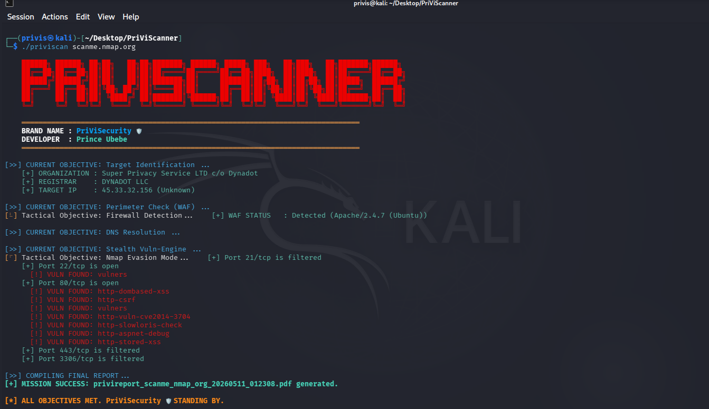

# PriVi_Network_Recon 🛡️ - Advanced IP & Web Intelligence Suite
**Version 1.0 — Developed by: PriViSecurity**

# PriVi_Network_Recon 🛡️ - Full Spectrum Recon Engine

**PriVi_Network_Reon** is a tactical reconnaissance and vulnerability scanning tool developed under the **PriViSecurity** brand. It combines infrastructure intelligence, DNS enumeration, and stealth vulnerability scanning into a single, automated workflow with a professional PDF reporting engine.

## 🚀 Features
- **Tactical Objective HUD**: Real-time loading animations for visual feedback.
- **Organization Intel**: Automated WHOIS and Geo-IP resolution.
- **Perimeter Check**: WAF (Web Application Firewall) detection.
- **DNS Infrastructure**: Enumeration of MX, NS, and TXT records.
- **Stealth Vuln-Engine**: Nmap-driven evasion scanning with decoys and fragmentation.
- **PDF Reporting**: Generates a professional "Full Spectrum Recon Report" upon completion.

## 🛠️ Installation

### 1. Clone the repository

git clone [https://github.com/your-username/PriViScanner.git](https://github.com/your-username/PriViScanner.git)
cd PriViScanner

### 2. Setup Environment

python3 -m venv scanner
source scanner/bin/activate
pip install -r requirements.txt

### 3. One-Touch Launcher (Optional but Recommended)

chmod +x priviscan

sudo ./priviscan <target>

### 4. Usage

The scanner requires sudo privileges to utilize Nmap's stealth evasion features (packet fragmentation and decoys).

sudo ./scanner/bin/python priviscanner.py scanme.nmap.org

🛡️ Developer

Name: Prince Ubebe

Brand: PriViSecurity

Tagline: Vulnerability Research • Threat Intelligence • Security Automation
⚠️ Disclaimer

This tool is for educational and ethical security testing purposes only. The developer is not responsible for any misuse or damage caused by this tool. Always obtain explicit permission before scanning any target.

